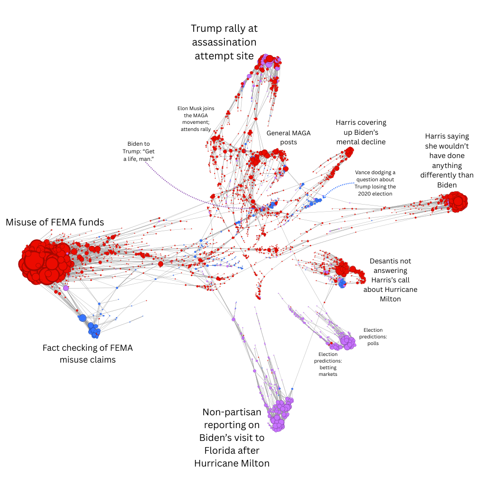

# 2024 US Presidential Election Political Tweets Network

## Goal: understand what was going on on X leading up to the election.

I created a similarity network of political tweets (Xes?) from October 2024. The tweets were drawn from [this dataset](https://github.com/sinking8/x-24-us-election), compiled using a custom web scraper that collected tweets with political hashtags, topics, and keywords. 
I sampled 50k tweets from the month of October, and connected them based on similarity. The graphic only shows the largest community from that month - a subset of about 2.5k tweets. This means that the stats and distribution of political leanings in this graphic are not necessarily representative of the 50k sample as a whole - it's very possible, for example, that there is a large pocket of blue in a smaller community that shares no connections with this community.

In the graphic, each circle is a tweet. The larger the circle, the more similar it is to other tweets in the network. Each line is a connection formed between tweets that have a similarity score of 0.67 or higher (on a scale of 0 to 1). 

I manually labeled each tweet as right-leaning (red), left-leaning (blue), or neutral (purple). I labeled different communities by topic. Take a look! 

## Some stats

- 74.9% of tweets were right-leaning
- 16.2% were neutral
- 8.9% were left-leaning

The most representative tweet of the largest topic community (Misuse of FEMA funds): "@KamalaHQ Biden/Harris had FEMA spend over $1 billion on illegals. They also made FEMA go woke and promote DEI. Now the Southeast is suffering as a result."
- This tweet is the closest to the average encoding of all the tweets in that community

## Takeaways

- X has made a rightward shift since Musk’s takeover - something I had heard but now have empirically confirmed
- Anyone can say anything on social media and sound like they know what they’re talking about - but there’s a good chance they don’t
- We’re all getting different news - people that see things differently than you likely aren’t bad; they’re synthesizing a very different body of information
